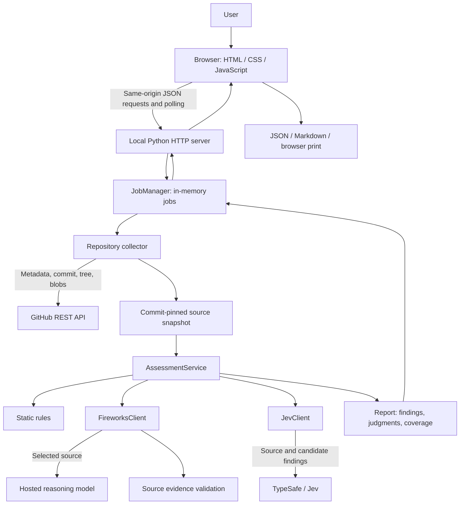
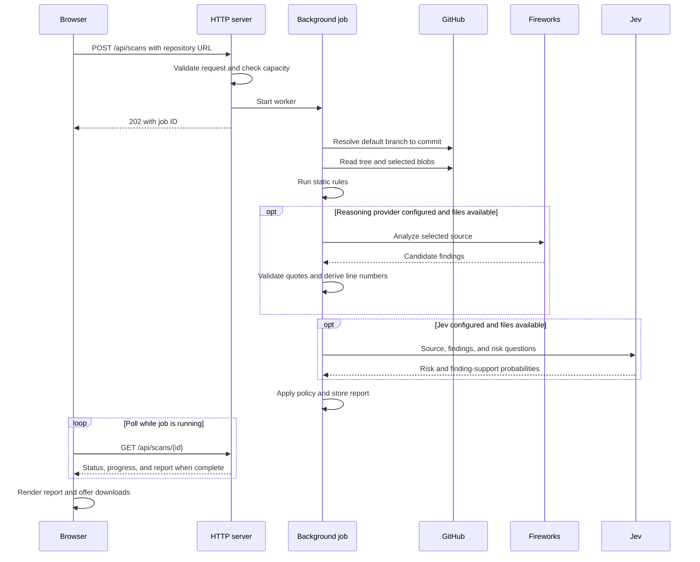

# Agents Be Safe — Technical Architecture

**Status:** Implemented local MVP, version 0.1.0  
**Last reviewed:** 2026-09-21  
**Scope:** Current repository implementation. Future improvements are identified separately.

## 1. Purpose and scope

Agents Be Safe assesses potential security risks in public GitHub repositories containing agent skills, MCP configuration, and custom tool implementations. It combines deterministic rules, a hosted reasoning model, and Jev's structured judgments to produce an evidence-linked report for human review.

The application reads source; it does not execute repository code, install dependencies, launch MCP servers, or invoke their tools. It is a local development application, not a production multi-user service or a certification that a project is safe.

The UI is branded **Powered by Jev**. Internally, Fireworks supplies the reasoning model and TypeSafe supplies Jev. This document names both integrations to describe the actual technical design. Presentation labels do not change the underlying providers or data transfers.

## 2. Technology stack

| Layer | Implementation |
| --- | --- |
| Frontend | Plain HTML, CSS, and JavaScript; no frontend framework or build step |
| Backend | Python 3.14+, using the standard library |
| HTTP server | `http.server.ThreadingHTTPServer`, bound to `127.0.0.1` |
| Outbound HTTP | Shared `urllib.request` JSON transport |
| Repository source | GitHub REST API: repository metadata, commits, trees, and blobs |
| Reasoning provider | Fireworks chat completions, with a configured model/deployment |
| Structured judgments | TypeSafe System One API, default model `jev-latest` |
| State | Process memory; a lock-protected job store and bounded semaphore |
| Validation | Explicit runtime response checks plus Python type annotations |
| Tests and tooling | `unittest`, mocked external APIs, local HTTP integration tests, Ruff |

There is no database, external queue, container runtime, vector store, authentication service, or third-party Python runtime dependency.

## 3. System architecture



All external API calls pass through `app/http_client.py`. Credentials are attached on the server, never in browser requests. Static rules, Fireworks analysis, and Jev evaluation run sequentially within each job; separate jobs can run concurrently.

## 4. Code organization and responsibilities

| Module | Responsibility |
| --- | --- |
| [`main.py`](../main.py) | Starts the local web application |
| [`app/config.py`](../app/config.py) | Immutable settings, environment loading, provider configuration flags |
| [`app/models.py`](../app/models.py) | Shared source, finding, evaluation, and report contracts |
| [`app/errors.py`](../app/errors.py) | `ScanError` for expected failures that can be shown to users |
| [`app/http_client.py`](../app/http_client.py) | JSON transport, authentication headers, response bounds, redirect rejection |
| [`app/providers/fireworks.py`](../app/providers/fireworks.py) | `FireworksClient.analyze`: model request, response parsing, validated findings |
| [`app/providers/jev.py`](../app/providers/jev.py) | `JevClient.evaluate`: typed questions and validated probabilities |
| [`app/scanning/repository.py`](../app/scanning/repository.py) | URL validation, file selection, commit-pinned collection |
| [`app/scanning/rules.py`](../app/scanning/rules.py) | Regex-based risk indicators |
| [`app/scanning/evidence.py`](../app/scanning/evidence.py) | Exact quote validation and computed line numbers |
| [`app/scanning/policy.py`](../app/scanning/policy.py) | Risk questions, severity order, support thresholds |
| [`app/scanning/assessment.py`](../app/scanning/assessment.py) | Combines findings, applies judgment policy, builds the report |
| [`app/scanning/demo.py`](../app/scanning/demo.py) | Fictional source for the offline sample report |
| [`app/web/jobs.py`](../app/web/jobs.py) | Job lifecycle, progress, concurrency, retention, failure handling |
| [`app/web/server.py`](../app/web/server.py) | Static assets, HTTP routes, origin checks, application construction |
| [`static/app.js`](../static/app.js) | Scan submission, polling, report rendering, filters, and exports |

`create_server()` constructs settings, `AssessmentService`, and a server-owned `JobManager`. `AssessmentService.from_settings()` constructs both provider clients. Settings are passed into the workflow rather than read independently by each provider. The collector also supports standalone use with environment-derived settings when none are supplied.

Jev returns judgments without mutating its input findings. The assessment layer applies support labels and decides the report verdict. This keeps provider response parsing separate from application policy.

## 5. Scan lifecycle



The browser polls immediately after submission and then waits 1,200 ms between unfinished responses. The server exposes `running`, `completed`, and `failed` states. A completed job can contain a limited assessment if either AI provider failed or collection was incomplete.

Demo mode substitutes fictional files for GitHub collection and skips both AI providers. It explicitly identifies the report as a sample using static rules only.

### 5.1 Repository collection

The collector accepts canonical HTTPS GitHub repository URLs, optionally ending in `.git` or a trailing slash. It rejects branch paths, query parameters, arbitrary hosts, and private repositories. It resolves the default branch once, then uses immutable commit and blob identifiers for inspection and report links.

Candidate files are selected by supported text extensions. Common dependency/build directories are excluded. Skill paths are prioritized, followed by MCP/configuration paths, then other supporting source in path order. This is a filename heuristic, not semantic discovery of every tool or dependency.

The collector rejects binary/non-UTF-8 content and does not follow symbolic links or submodules. Budget exclusions and recoverable file-read failures become skipped-file entries. GitHub tree truncation is recorded. Failure to obtain repository metadata, the commit, or the tree fails the job.

Supported extensions are `.md`, `.py`, `.js`, `.ts`, `.tsx`, `.mjs`, `.cjs`, `.json`, `.toml`, `.yaml`, `.yml`, `.sh`, `.ps1`, `.go`, and `.rs`. Excluded or unsupported files are not all individually listed in the report: candidate coverage is not whole-repository coverage.

### 5.2 Static checks and reasoning analysis

Static rules produce at most one match per rule per file. Matches include instruction overrides, dangerous execution patterns, possible credential transfer, broad permissions, and mutable/external dependencies. These indicators can also match harmless examples or documentation.

Fireworks receives the selected source in a single chat-completion request. The request uses temperature `0`, JSON-object mode, and an output budget of `6,000` tokens. The configured model must support these options and have enough context for the selected files. There is no automatic chunking or model fallback.

The prompt requests at most 30 findings. Validation requires known categories and severities, nonempty bounded text fields, a collected source path, and an exact source quote. The application derives the line number from the first occurrence of that quote. It rejects the entire reasoning response if any finding is invalid or the model does not finish with `stop`.

Quote validation proves that evidence exists, not that the security claim is correct. Static and model findings are appended without deduplication, so counts can include overlapping indicators.

### 5.3 Jev evaluation and report policy

Jev receives the source plus combined candidate findings. A single request includes five independent `noul` questions for risk dimensions, plus one support question per finding. Each answer must be a finite number in `[0, 1]`, with type `noul`; booleans, missing answers, and malformed responses are rejected.

Risk dimensions are `prompt_injection`, `data_exfiltration`, `unsafe_execution`, `excessive_access`, and `supply_chain`.

| Finding support probability | Display label |
| --- | --- |
| `p >= 0.8` | Supported by Jev |
| `p <= 0.2` | Models disagree |
| Otherwise | Needs review |

Findings are retained even when Jev disagrees. These thresholds are experimental and have not been calibrated against a labeled security dataset.

The overall verdict follows this order:

1. **High risk indicators:** any high/critical finding, or any Jev risk-dimension probability at least `0.8`.
2. **Review required:** at least one finding remains.
3. **No findings in inspected files:** no findings and the bounded assessment completed.
4. **Inconclusive:** otherwise.

The bounded assessment is complete only for a live scan with nonempty inspected files, no skipped entries, no truncated tree, and both providers recorded as having run. A high-risk verdict can coexist with incomplete coverage. Completion does not certify safety or imply that dependencies and remote servers were inspected.

## 6. Data contracts

Contracts live in `app/models.py`. `TypedDict` annotations document structure but do not enforce runtime validation automatically; the collector and provider adapters perform explicit checks.

| Contract | Main fields |
| --- | --- |
| `SourceFile` | `path`, `content`, `kind` |
| `Snapshot` | `repository`, `commit`, `files`, `skipped`, `tree_truncated`, `candidate_count` |
| `Finding` | `path`, `line`, `category`, `severity`, `title`, `evidence`, `explanation`, `remediation`, `origin`, `verification`, optional `support_probability` |
| `JevEvaluation` | `dimensions`, ordered `finding_support`, `model` |
| `Report` | Repository/commit, UTC creation time, mode, verdict, coverage status, providers, dimensions, findings, warnings, inspected-file metadata, skipped entries |
| `Job` | `status`, `message`, Unix `started` timestamp, optional `report` |

The report retains evidence excerpts but does not include complete source-file contents. Job reads return deep copies, preventing callers from modifying the stored report. JSON export preserves the raw report, including technical provider identifiers. Markdown export also uses raw report fields; UI label substitutions are presentation-only.

## 7. HTTP API

The browser and API share an origin. JSON responses use `Cache-Control: no-store`.

| Method and path | Purpose | Normal result |
| --- | --- | --- |
| `GET /` | Serve the UI | HTML |
| `GET /app.js`, `GET /style.css` | Serve fixed, allowlisted assets | JavaScript or CSS |
| `GET /api/config` | Check whether credentials/model settings exist | `200`, provider booleans; not a connectivity check |
| `POST /api/scans` | Submit a live or demo scan | `202`, `{"id": "opaque-job-id"}` |
| `GET /api/scans/{id}` | Retrieve status or finished report | `200`, job object |

Live request:

```json
{"url": "https://github.com/owner/repository", "demo": false}
```

Demo request:

```json
{"demo": true}
```

POST requests require the exact content type `application/json`, a JSON object, and a body between 1 and 2,048 bytes. `demo` activates only for the JSON boolean `true`. Invalid input receives `400`; rejected host/origin/content-type checks receive `403`; missing jobs or unknown routes receive `404`; exhausted scan capacity receives `429`.

Job IDs are generated with `secrets.token_urlsafe(24)`. They are opaque lookup identifiers, not a replacement for authentication. There are no cancellation, deletion, history-listing, or server-side report-export endpoints.

## 8. Limits, concurrency, and failure handling

| Control | Current value / behavior |
| --- | --- |
| Successfully collected files | Maximum 40 |
| Decoded source bytes per file | Maximum 24,000 |
| Total collected source bytes | Maximum 180,000 |
| Outbound JSON response | Maximum 4,000,000 bytes |
| Outbound socket timeout | 90 seconds; not an overall scan deadline |
| Incoming connection timeout | 15 seconds |
| Concurrent scan workers | 2 per application server |
| Excess scan submissions | Rejected immediately; no waiting queue |
| Retry/backoff | Not implemented |

The file-count limit applies to successfully collected files, not total attempted blob requests. Repeated failures can therefore cause more than 40 blob requests. There is no global job-duration or request-attempt budget. Scan concurrency is bounded, but the development HTTP server's request threads are not managed by that semaphore.

Expected provider errors become report warnings, preserving available static findings. Jev can still run when Fireworks fails. Unexpected worker exceptions become a generic failure message. Worker capacity is released in `finally`.

Jobs run in daemon threads and are lost if the process exits. On each new accepted scan, completed/failed jobs older than one hour from their start time are pruned, and only the newest 18 existing completed jobs are retained before insertion. With up to two active jobs this keeps the store around 20 entries. Pruning is submission-triggered, not a scheduled expiration guarantee.

## 9. Trust boundaries and data handling

| Boundary | Implemented behavior | Remaining limitation |
| --- | --- | --- |
| Browser to backend | Loopback binding; host allowlist; supplied origins must match; JSON-only POST | No user authentication or per-user authorization; absent Origin is permitted for local clients |
| Backend to GitHub | Canonical URL validation; fixed API host; redirects refused; bounded reads | No retries, dependency traversal, private-repository support, or complete semantic file discovery |
| Source to AI models | Source identified as untrusted data; no execution tools exposed; evidence checks | Prompt instructions and valid quotes cannot guarantee resistance to model manipulation |
| AI output to browser | DOM text rendering, restrictive CSP, no-sniff, no-referrer, frame blocking | Model claims can still be wrong; human review is necessary |
| Credential handling | Server settings only; secrets excluded from dataclass representations | Process environment is not a secret-management service |
| Report storage | In-memory only; deep-copy reads; no standard HTTP access logging | Evidence may contain sensitive text; no redaction or durable audit trail |

Selected source files are sent to Fireworks. Selected source plus candidate findings are sent to TypeSafe. The optional GitHub token is used for GitHub requests only; provider keys authenticate their respective APIs. Repository content is not scanned for secrets before transmission. Public source can still contain accidentally published credentials.

The application does not configure or guarantee the external providers' retention policies. Downloaded reports persist wherever the user saves them, independently of server job retention.

## 10. Local operation and configuration

From the project root, with Python 3.14 or newer:

```powershell
python main.py
```

Open `http://127.0.0.1:8000`. The sample report works without credentials. The server uses environment variables loaded at startup; `.env` files are **not automatically loaded**. Restart after configuration changes.

| Variable | Default | Purpose |
| --- | --- | --- |
| `FIREWORKS_API_KEY` | Empty | Reasoning provider authentication |
| `FIREWORKS_MODEL` | Empty | Exact reasoning model/deployment identifier |
| `TYPESAFE_API_KEY` | Empty | Jev authentication |
| `TYPESAFE_MODEL` | `jev-latest` | Jev model identifier |
| `GITHUB_TOKEN` | Empty | Optional authenticated public repository reads |
| `PORT` | `8000` | Loopback listening port; valid range 1–65535 |

Both reasoning settings and the Jev key are required for a full AI assessment. Collection limits are `Settings` fields, not environment variables. No install or frontend build is required for the current runtime. See [the README](../README.md) for startup commands and [.env.example](../.env.example) for configuration names.

## 11. Verification and change guidance

Tests in [`tests`](../tests) cover repository validation, collection exclusions, real source evidence, malformed provider responses, Jev support judgments, provider failure behavior, orchestration, configuration, job isolation, concurrency cleanup, and local HTTP routes.

```powershell
python -m unittest discover -s tests -v
python -m ruff check app tests main.py
python -m ruff format --check app tests main.py
```

Ruff is a development tool and must be installed separately. External responses are mocked; these tests do not validate paid provider connectivity, model quality, or detection accuracy. The refactor was verified with 26 passing tests. No continuous integration workflow or automated browser test suite is currently configured.

When changing a provider, keep request/response handling in its adapter and preserve the service-facing return contract. When changing support thresholds, update `scanning/policy.py` and assessment tests. When adding a report field, update `models.py`, the report builder, and both browser exporters. When broadening collection, test coverage accounting and resource limits alongside detection behavior.

## 12. Future architecture work — not implemented

| Area | Potential next step |
| --- | --- |
| Production serving | Production HTTP stack, authenticated users, TLS, per-user report ownership |
| Durable jobs | Persistent job queue/database, cancellation, restart recovery, reliable retention |
| Resource controls | Overall deadlines, attempted-request limits, quotas, token/cost budgets, retry/backoff |
| Detection quality | Labeled evaluation corpus, calibrated thresholds, deduplication, prompt-injection robustness tests |
| Large repositories | Dependency-aware selection, chunking with explicit coverage, cross-file analysis |
| Private repositories | Explicit authorization and data-sharing policy, appropriately scoped repository access |
| Remote MCP analysis | Separate isolated service with restricted credentials, filesystem, and network access |
| Operations | Structured redacted logs, metrics, provider latency/usage tracking, deployment checks |

These are extension points, not properties of the current application. The existing deployment should remain local until the appropriate hosting and isolation controls are implemented.
